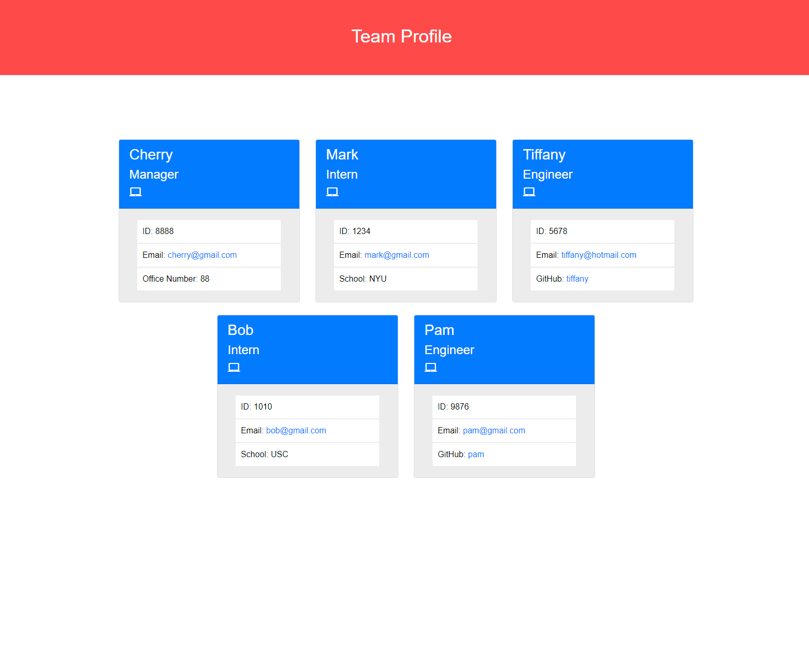

# Team Profile Generator


## Description 
This command-line application was created to generate a team profile based on user input in the terminal while using the inquirer module from Node.js. It takes in information about employees on a software engineerng team and then generates an HTML webpage that displays summaries for each person. 


## User Story
```
AS A manager
I WANT to generate a webpage that displays my team's basic info
SO THAT I have quick access to their emails and GitHub profiles
```

## Criteria
```
GIVEN a command-line application that accepts user input
WHEN I am prompted for my team members and their information
THEN an HTML file is generated that displays a nicely formatted team roster based on user input
WHEN I click on an email address in the HTML
THEN my default email program opens and populates the TO field of the email with the address
WHEN I click on the GitHub username
THEN that GitHub profile opens in a new tab
WHEN I start the application
THEN I am prompted to enter the team manager’s name, employee ID, email address, and office number
WHEN I enter the team manager’s name, employee ID, email address, and office number
THEN I am presented with a menu with the option to add an engineer or an intern or to finish building my team
WHEN I select the engineer option
THEN I am prompted to enter the engineer’s name, ID, email, and GitHub username, and I am taken back to the menu
WHEN I select the intern option
THEN I am prompted to enter the intern’s name, ID, email, and school, and I am taken back to the menu
WHEN I decide to finish building my team
THEN I exit the application, and the HTML is generated
```


## Preview
The following image shows a mock-up of the generated HTML’s appearance and functionality:




## Installation 
Repository link: https://github.com/c1am/profile-maker
Deployment link: To be ran in terminal
Please clone the repository and download Node. Then install the inquirer module by typing `npm i inquirer` into the terminal. 


## Usage 
Open an integrated terminal from the index.js file and then run `node index.js` from the terminal to start generating the profile. You can also view a sample profile by opening the index.html file directly in a browser.


## Tests
Run `npm test` in the terminal to run Jest for tests on constructors. 


## Built With
- Javascript
- MySQL


## Authors
- Cherry Lam 
    - [GitHub](https://github.com/c1am)
    - [Email](mailto:cherrylam.ny@gmail.com)